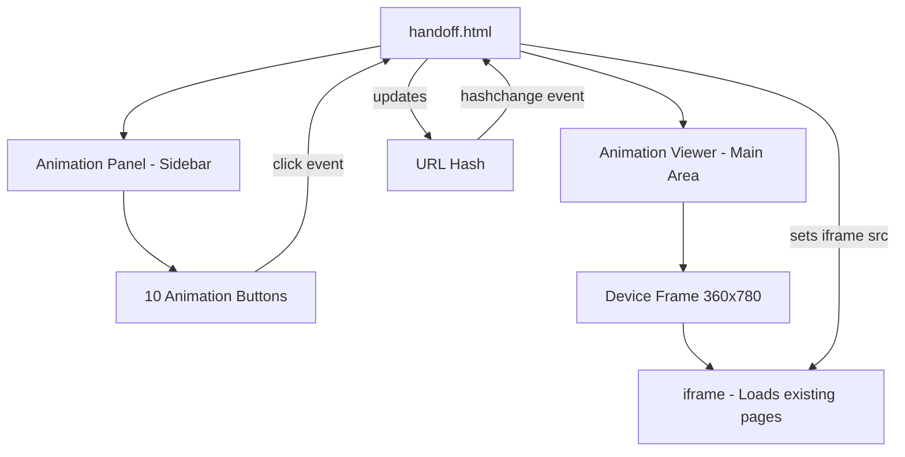

# Design Document: Animation Handoff Interface

## Overview

La interfaz de Animation Handoff es una página HTML única (`handoff.html`) que actúa como hub de referencia para el equipo de desarrollo. Permite visualizar las 10 animaciones del proyecto de forma aislada dentro de un device frame, con navegación por botones, deep links compartibles y metadatos descriptivos.

La arquitectura se basa en un enfoque **iframe-based**: cada animación se carga embebiendo la página HTML existente del proyecto dentro de un iframe contenido en el device frame. Esto evita recrear animaciones y aprovecha directamente los archivos ya existentes (login.html, onboarding.html, signup-flow.html, dashboard.html, activation.html, etc.).

### Decisiones de diseño clave

1. **Iframe para aislamiento**: Cada animación se renderiza en un iframe independiente, garantizando aislamiento de CSS/JS y permitiendo reiniciar animaciones simplemente recargando el iframe.
2. **Hash-based routing**: Se usa `window.location.hash` para deep links, evitando recargas de página y permitiendo compartir URLs directas.
3. **Catálogo declarativo en JS**: Las 10 animaciones se definen como un array de objetos con nombre, descripción, hash, archivo fuente y URL del iframe.
4. **Sin dependencias externas**: Solo HTML, CSS y JS vanilla, consistente con el stack del proyecto.

## Architecture



### Layout Structure

```
┌─────────────────────────────────────────────────────────┐
│  Header: Logo + "Animation Handoff" + Copy Link Button  │
├──────────────────┬──────────────────────────────────────┤
│                  │                                      │
│  Animation Panel │       Animation Viewer               │
│  (Sidebar)       │       ┌────────────────────┐        │
│                  │       │   Device Frame      │        │
│  [Button 1]      │       │   ┌──────────────┐ │        │
│  [Button 2]      │       │   │              │ │        │
│  [Button 3]      │       │   │   iframe     │ │        │
│  ...             │       │   │              │ │        │
│  [Button 10]     │       │   └──────────────┘ │        │
│                  │       └────────────────────┘        │
│                  │       [Replay Button]                │
└──────────────────┴──────────────────────────────────────┘
```

En viewports < 1024px, el layout cambia a una sola columna con el panel arriba y el viewer debajo.

## Components and Interfaces

### 1. Animation Catalog (Data Layer)

```javascript
// Catálogo declarativo de animaciones
const ANIMATIONS = [
  {
    id: 'splash-animation',
    name: 'Splash animation de entrada',
    description: 'Pantalla inicial - video de fondo con fade-in de logo y botones CTA',
    source: 'index.html',
    url: 'index.html',
    type: 'loop' // loop | finite
  },
  // ... 9 más
];
```

**Interfaz pública:**
- `getAnimationByHash(hash: string): Animation | null`
- `getAllAnimations(): Animation[]`

### 2. Animation Panel Component

Responsabilidades:
- Renderizar la lista de botones con nombre, descripción y ruta del archivo fuente
- Gestionar el estado activo (un solo botón activo a la vez)
- Emitir eventos de selección
- Soportar navegación por teclado (Tab, Enter, ArrowUp/ArrowDown)
- Aplicar ARIA roles: `role="tablist"` en contenedor, `role="tab"` en cada botón

**Interfaz:**
- `renderPanel(animations: Animation[]): void`
- `setActive(animationId: string): void`
- `onSelect(callback: (animation) => void): void`

### 3. Animation Viewer Component

Responsabilidades:
- Mostrar el device frame con dimensiones fijas (360×780px)
- Cargar la animación seleccionada en un iframe
- Mostrar estado vacío cuando no hay selección
- Proveer botón de replay (recargar iframe)
- Gestionar el botón de replay según tipo de animación (siempre visible para loops)

**Interfaz:**
- `loadAnimation(animation: Animation): void`
- `showEmptyState(): void`
- `replay(): void`

### 4. Router (Hash-based)

Responsabilidades:
- Leer el hash inicial al cargar la página
- Actualizar el hash cuando se selecciona una animación
- Escuchar `hashchange` para navegación con botones del navegador
- Validar hashes contra el catálogo

**Interfaz:**
- `getCurrentHash(): string`
- `setHash(hash: string): void`
- `onHashChange(callback: (hash) => void): void`

### 5. Copy Link Feature

Responsabilidades:
- Construir la URL completa con hash
- Copiar al portapapeles usando `navigator.clipboard.writeText()`
- Mostrar feedback visual temporal (2 segundos)

**Interfaz:**
- `copyCurrentLink(): Promise<void>`
- `showCopyFeedback(): void`

## Data Models

### Animation Entry

```typescript
interface Animation {
  id: string;           // kebab-case, usado como hash fragment
  name: string;         // Nombre visible en el panel
  description: string;  // Max 120 caracteres, contexto de uso
  source: string;       // Ruta relativa del archivo fuente (ej: "js/main.js")
  url: string;          // URL de la página a cargar en el iframe
  type: 'loop' | 'finite'; // Determina comportamiento del botón replay
}
```

### Animation Catalog (las 10 animaciones)

| # | ID | Nombre | URL | Source | Tipo |
|---|---|---|---|---|---|
| 1 | splash-animation | Splash animation de entrada | index.html | index.html | loop |
| 2 | keyboard-forms | Comportamiento de teclado en Forms | login.html | css/login.css | finite |
| 3 | bottom-sheets | Animación Bottom Sheets | login.html | css/login.css | finite |
| 4 | success-animation | Animación Success | signup-flow.html | css/signup-flow.css | finite |
| 5 | verified-animation | Animación Verified | signup-flow.html | js/signup-flow.js | finite |
| 6 | stroke-banner | Animación Stroke-Banner | dashboard.html | css/style.css | loop |
| 7 | button-highlight | Animación Highlight de botones | dashboard.html | css/login.css | finite |
| 8 | checklist-step | Animación Checklist Step | activation.html | css/activation.css | finite |
| 9 | address-animation | Animación Address | signup-flow.html | js/signup-flow.js | finite |
| 10 | screen-transition | Animación Transición entre pantallas | dashboard.html | js/main.js | finite |

### Application State

```typescript
interface AppState {
  currentAnimation: Animation | null;  // Animación actualmente seleccionada
  panelVisible: boolean;               // Siempre true en esta versión
}
```

## Correctness Properties

*A property is a characteristic or behavior that should hold true across all valid executions of a system—essentially, a formal statement about what the system should do. Properties serve as the bridge between human-readable specifications and machine-verifiable correctness guarantees.*

### Property 1: Animation selection loads correct page

*For any* animation in the catalog, when that animation is selected (via click or hash navigation), the iframe `src` attribute should equal the animation's `url` field, the URL hash should equal the animation's `id`, and the corresponding button should have the active state.

**Validates: Requirements 2.2, 3.1, 4.2, 4.3**

### Property 2: Active state exclusivity

*For any* animation selection, exactly one button in the panel should have the active visual state (`aria-selected="true"` and active CSS class), and all other buttons should have `aria-selected="false"`.

**Validates: Requirements 2.3, 7.3**

### Property 3: Hash uniqueness and kebab-case format

*For any* two distinct animations in the catalog, their `id` values (used as hash fragments) should be different, and each `id` should match the pattern `^[a-z][a-z0-9]*(-[a-z0-9]+)*$` (valid kebab-case).

**Validates: Requirements 4.1**

### Property 4: Invalid hash fallback

*For any* string that is not a valid animation `id` in the catalog, when used as the URL hash, the interface should display the empty state with no animation loaded and no button in active state.

**Validates: Requirements 4.5, 1.5**

### Property 5: Copy link produces correct URL

*For any* selected animation, the copy-to-clipboard function should produce a URL string that ends with `#` followed by the animation's `id`, and the full URL should be a valid absolute URL pointing to `handoff.html`.

**Validates: Requirements 4.4**

### Property 6: Re-selection restarts animation

*For any* animation that is currently active, clicking its button again should trigger a reload of the iframe (the iframe's src is re-assigned or the iframe is replaced), effectively restarting the animation from the beginning.

**Validates: Requirements 2.6**

### Property 7: Arrow key navigation wraps correctly

*For any* focused button at index `i` in the panel (0-indexed, total N buttons), pressing ArrowDown should move focus to index `(i + 1) % N`, and pressing ArrowUp should move focus to index `(i - 1 + N) % N`.

**Validates: Requirements 7.4**

### Property 8: Description length constraint

*For any* animation entry in the catalog, its `description` field should have a length of at most 120 characters.

**Validates: Requirements 5.2**

## Error Handling

### Escenarios de error y estrategias

| Escenario | Estrategia |
|---|---|
| Hash inválido en URL | Mostrar estado vacío, no seleccionar ningún botón |
| Iframe no carga (404) | Mostrar mensaje de error dentro del device frame |
| Clipboard API no disponible | Fallback con `document.execCommand('copy')`, o mostrar URL en un input seleccionable |
| Archivo fuente no existe | Mostrar indicador visual (icono de advertencia) junto a la ruta |
| Viewport muy pequeño (<320px) | Degradación graceful, panel colapsado con scroll |

### Manejo de errores del iframe

```javascript
// Detectar errores de carga del iframe
iframe.addEventListener('error', () => {
  showErrorState('No se pudo cargar la animación');
});

// Timeout para páginas que no cargan
const loadTimeout = setTimeout(() => {
  showErrorState('La animación tardó demasiado en cargar');
}, 10000);

iframe.addEventListener('load', () => {
  clearTimeout(loadTimeout);
});
```

### Clipboard fallback

```javascript
async function copyToClipboard(text) {
  if (navigator.clipboard && navigator.clipboard.writeText) {
    await navigator.clipboard.writeText(text);
  } else {
    // Fallback para navegadores sin Clipboard API
    const input = document.createElement('input');
    input.value = text;
    document.body.appendChild(input);
    input.select();
    document.execCommand('copy');
    document.body.removeChild(input);
  }
}
```

## Testing Strategy

### Unit Tests (Example-based)

Tests específicos para verificar comportamientos concretos:

1. **Rendering inicial**: Verificar que los 10 botones se renderizan al cargar
2. **Estado vacío**: Sin hash, se muestra el mensaje de estado vacío
3. **Device frame dimensions**: Verificar CSS del frame (360×780, border-radius 40px)
4. **Logo visible**: El logo de Ontop está presente en el header
5. **Responsive layout**: A < 1024px, layout cambia a columna única
6. **Focus indicator**: Botones con foco tienen outline >= 2px
7. **Font loading**: Link a General Sans presente en el head
8. **Monospace source path**: La ruta del archivo usa font-family monospace

### Property-Based Tests

Se usará **fast-check** como librería de property-based testing para JavaScript.

Cada property test debe ejecutar un mínimo de 100 iteraciones y estar etiquetado con referencia al documento de diseño:

```javascript
// Tag format: Feature: animation-handoff, Property {N}: {description}
```

**Properties a implementar:**
1. Animation selection loads correct page (Property 1)
2. Active state exclusivity (Property 2)
3. Hash uniqueness and kebab-case format (Property 3)
4. Invalid hash fallback (Property 4)
5. Copy link produces correct URL (Property 5)
6. Re-selection restarts animation (Property 6)
7. Arrow key navigation wraps correctly (Property 7)
8. Description length constraint (Property 8)

### Integration Tests

1. **Flujo completo**: Seleccionar animación → verificar iframe carga → copiar link → navegar con hash
2. **Navegación con historial**: Usar back/forward del navegador con hashes
3. **Accesibilidad**: Navegar toda la interfaz solo con teclado

### Herramientas

- **Test runner**: Vitest (compatible con vanilla JS, rápido, soporte ESM)
- **PBT library**: fast-check
- **DOM testing**: jsdom (para simular DOM en tests unitarios)
- **Accessibility**: axe-core para validación ARIA automática
